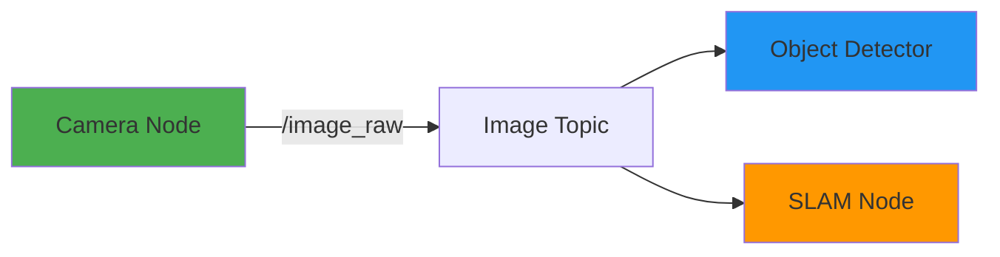
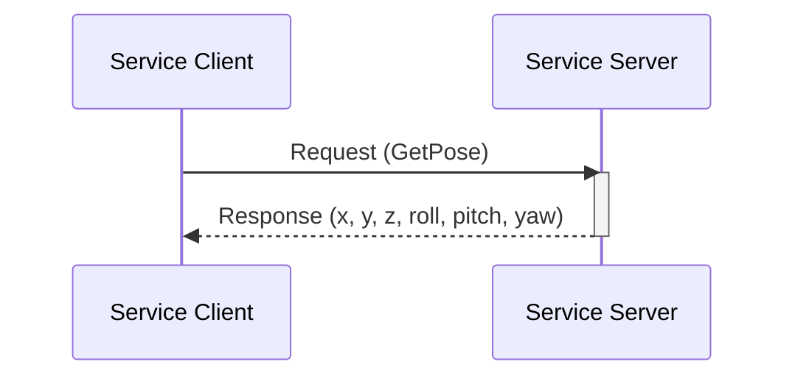
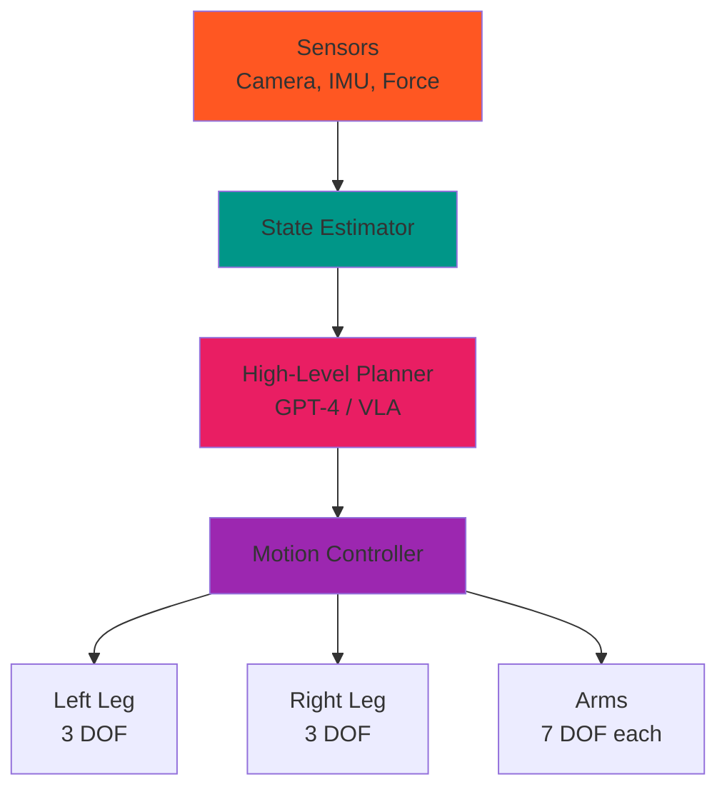
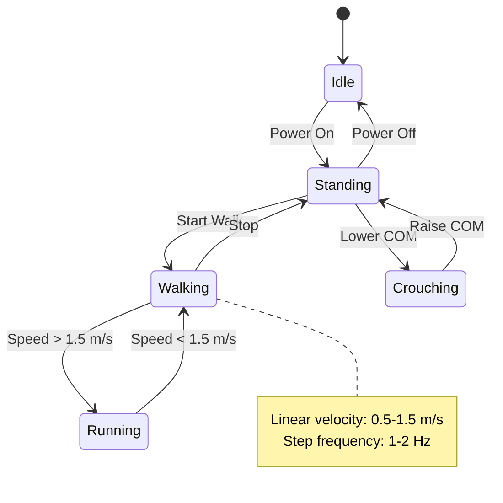
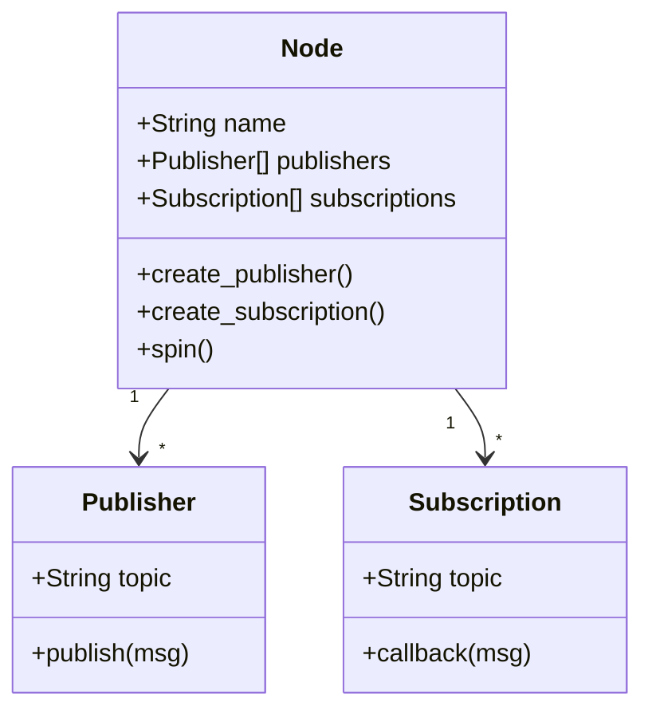
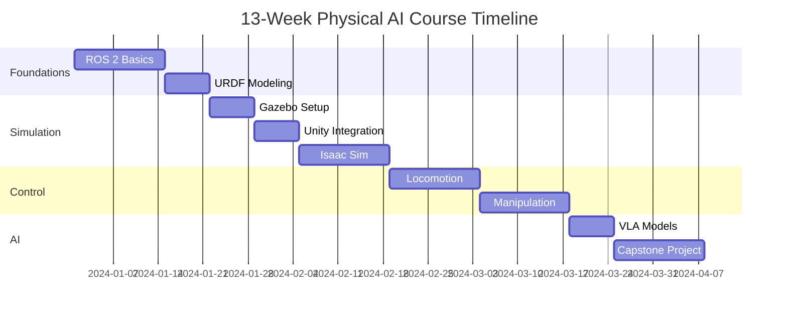
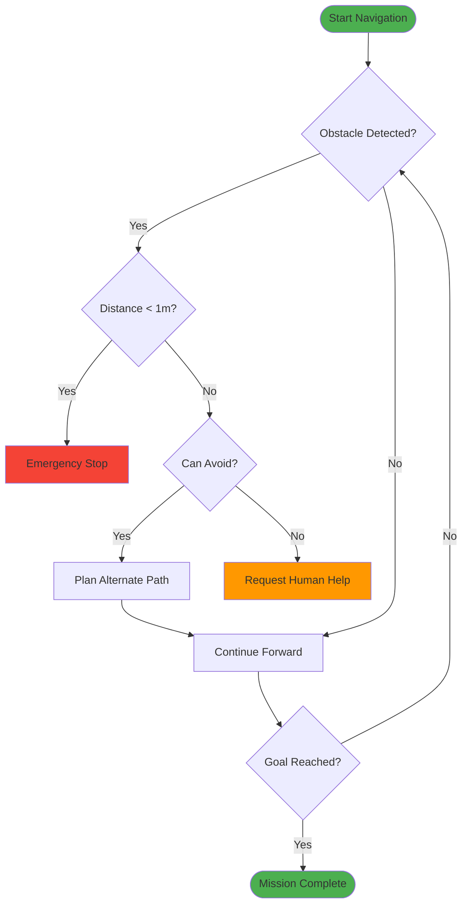
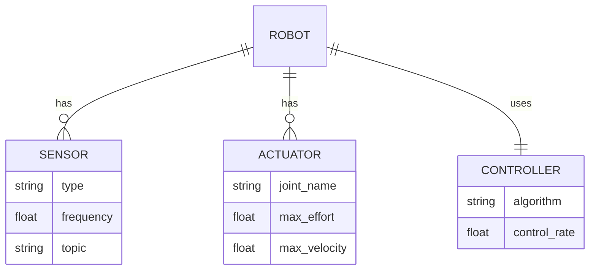

# Example Mermaid Diagrams

This page demonstrates the various diagram types available in the textbook using Mermaid.js.

## ROS 2 Communication Patterns

### Publisher-Subscriber

### Service-Client

## Humanoid Robot Architecture

## State Machines

### Locomotion Controller

## Class Diagrams

### ROS 2 Node Hierarchy

## Timeline Diagrams

### Capstone Project Timeline

## Flowcharts

### Navigation Decision Tree

## Entity Relationship

### Robot Database Schema

---

## Usage in MDX

To add a diagram to your chapter, use triple backticks with `mermaid`:

\`\`\`mermaid
graph LR
    A[Start] --> B[End]
\`\`\`

<!-- See SKILLS_GUIDE.md for more examples and advanced usage. -->
